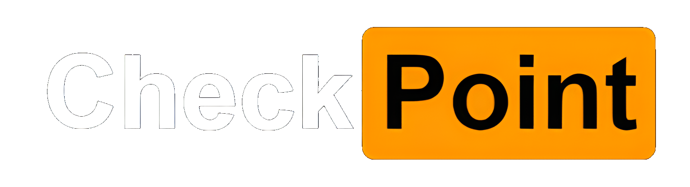

# Requirements
- Any version of Python 3.8. (Anything higher will not work. Unsure how low you can go.)
- Install pip.
- Use pip to install all of the libraries from [requirements.txt](./requirements.txt).

# Usage Instructions
- The entire application can be found within the [app](./app) folder.
- Run [app.py](./app/app.py) and wait for flask webpage to host. 
- Enter the URL http://127.0.0.1:5000/ into your browser to gain access to the website.
- The Available accounts are as follows **(CASE SENSITIVE)**:
 **IMPORTANT: LOGOUT BEFORE LOGGING INTO ANY OTHER ACCOUNT!!!**
    - Username: **admin**, Password: **admin** | Manager Account
    - Username: **user**, Password: **user** | Employee Account
    - Username: **employee**, Password: **employee** | Employee Account

- Organizations login can be accessed from http://127.0.0.1:5000/org_login.
- Organization login information is as follows **(CASE SENSITIVE)**:
 **IMPORTANT: LOGOUT BEFORE LOGGING INTO ANY OTHER ACCOUNT!!!**
  - Username: **checkpoint**, Password: **checkpoint** | Manager Account
- **Logout** button can be found within the hamburger menu on the top right of the website. 
# Abstract
In recent years, the Coronavirus disease has slowed the progression of most organizations. While many people are eager to return to how things were before the pandemic, it is more important than ever to keep in mind the health and safety of others. With businesses ramping back up, there is a need of urgency to be efficient due to the time lost during the pandemic’s peak. All organizations have a method of tracking their employees, but the process could be more unified and efficient.​

The objective of Check Point is to make it, so organizations have a convenient way of tracking their employees (through when clocking in/out, their timecard, checking if an employee is experiencing any symptoms, and mask requirement detection). The result will be a combination of several features from separate services/applications in order to maximize efficiency and minimize costs. We have developed a web-based application that will serve as an efficient work check-in method. The application will come with a variety of features that a manager can customize to best fit their organization. ​